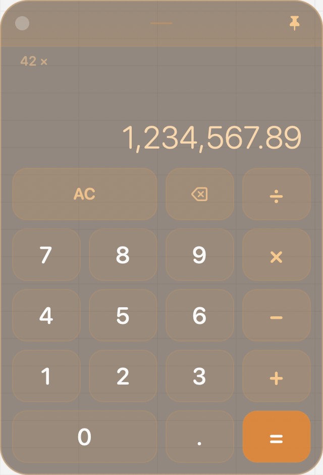
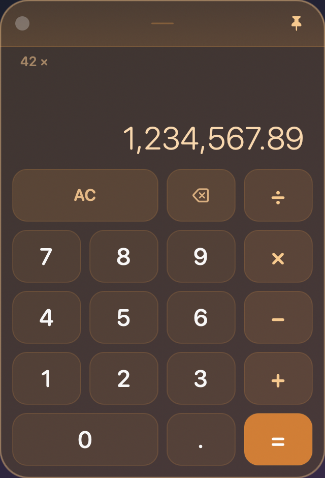

# 算盘 · SuanPan

**A native macOS desktop calculator with real Liquid Glass.** Unframed, always on your desktop, fades out when idle — always within reach while you work on spreadsheets or do bookkeeping.

**macOS 原生桌面计算器，真·液态玻璃材质。** 无边框、常驻桌面、空闲自动淡出 —— 做表格、算账时随时在手边。

> **Not a web wrapper — a native app** compiled with Swift + AppKit. The glass material uses the system `NSGlassEffectView`, which genuinely refracts whatever is behind it. Window pinning and cross-Space persistence are handled by the system window layer.
>
> **不是网页套壳，是原生 App** —— Swift + AppKit 编译。玻璃材质调用系统 `NSGlassEffectView`，会真实折射背后内容；窗口置顶、跨桌面常驻都由系统窗口层实现。

| Light backdrop / 浅色背景 | Dark backdrop / 深色背景 |
|:--:|:--:|
|  |  |

> Images above are off-screen renders produced by the app itself (used to evaluate contrast and layout). **The real glass refraction and blur can only be seen on a live system.**
>
> 上图为 App 内置的离屏渲染样张（用于评估对比度与布局）。**真实玻璃的折射与模糊需在真机查看。**

---

## Features · 功能特性

| English | 中文 |
|---|---|
| **Only the four basic operations** — `+ − × ÷`, plus `AC` and backspace. No sign toggle, no percent, no scientific functions. | **只有四则运算** —— `+ − × ÷`，加 `AC` 清零与退格。没有正负号、百分比、科学函数这些用不上的东西。 |
| **Top bar** — close button on the left, a **togglable pin** on the right for always-on-top; drag anywhere on the bar to move the window. | **顶部栏** —— 左上关闭、右上**图钉可反复切换置顶**；顶栏空白处按住即可拖动整窗。 |
| **Idle fade** — 1.5 s after the pointer leaves the window, the whole app smoothly fades to 40% opacity. The top bar actually gets *brighter* while faded, so you can still spot it at a glance. | **空闲淡出** —— 鼠标离开窗口 1.5 秒后整体平滑淡到 40% 不透明度；淡出时顶栏反而**提高**自身亮度，一眼还能认出它在哪。 |
| **Lives on every Space** — joins all Spaces (`canJoinAllSpaces`), so it stays visible when you switch desktops or go full-screen in Excel. | **桌面常驻** —— 加入所有桌面空间（`canJoinAllSpaces`），切桌面、Excel 全屏时它都还在。 |
| **Remembers its position** — move it somewhere convenient; it will be there next launch. | **位置记忆** —— 挪到顺手的地方，下次启动还在那。 |
| **Keyboard input** — number pad, operators, Return, Backspace and Esc all work directly. | **键盘直接输入** —— 数字小键盘、运算符、回车、退格、Esc 全部可用。 |
| Orange accent colour, with the whole palette centralised in one `Palette` enum. | 橘色主色调，配色集中在一个 `Palette` 枚举里，想换色改一处即可。 |

## Keyboard · 快捷键

| Key · 按键 | Action · 作用 |
|---|---|
| `0-9` `.` | Enter digits · 输入数字 |
| `+` `-` `*` `x` `/` `:` | Add, subtract, multiply, divide · 加减乘除 |
| `Return` / `Enter` / `=` | Evaluate · 求得结果 |
| `Delete` / `Backspace` | Delete one digit · 退格（逐位删除） |
| `Esc` | Clear (AC) · 清零 |
| `⌘Q` | Quit · 退出 |

---

## Requirements · 系统要求

| Item · 项目 | Requirement · 要求 | Notes · 说明 |
|---|---|---|
| OS · 系统 | **macOS 26.0 or later** | The Liquid Glass API `NSGlassEffectView` is available from macOS 26. **The app will not launch on earlier versions.** · 低版本**无法运行** |
| Chip · 芯片 | **Apple Silicon (arm64)** | Current build is arm64-only; Intel users must rebuild (see below). · 当前产物为 arm64，Intel 机型需自行重编 |
| Toolchain · 编译 | Xcode Command Line Tools | Only needed when building from source: `xcode-select --install`. · 仅自行编译时需要 |

## Installation · 安装

### Option 1 — Use a prebuilt `.app` (for users · 推荐给使用者)

If you already have `算盘.app` (built yourself, or downloaded from Releases when available), drag it into your Applications folder.
如果你手上已经有 `算盘.app`（自己构建的，或从 Releases 下载的），直接拖进「应用程序」文件夹即可。

1. The first launch will be blocked by Gatekeeper (the app is **not notarised by Apple** — only ad-hoc signed). Clear it with either method:
   首次打开会被 Gatekeeper 拦下（应用**未做 Apple 公证**，只做了 ad-hoc 签名），任选一种方式放行：

   ```bash
   # Method A — strip the quarantine flag (simplest) · 方式 A：移除隔离标记（最省事）
   xattr -dr com.apple.quarantine /Applications/算盘.app
   ```

   > Method B: right-click the app → **Open**. If still blocked, go to **System Settings → Privacy & Security**, find the blocked-app notice at the bottom and click **Open Anyway**.
   >
   > 方式 B：右键点 App →「打开」；若仍被拦，去「系统设置 → 隐私与安全性」，在底部找到被拦提示点「仍要打开」。

2. To keep it in the Dock: launch it, then right-click the Dock icon → Options → **Keep in Dock**.
   想常驻 Dock：启动后右键 Dock 图标 → 选项 → **在程序坞中保留**。

### Option 2 — Build from source (for developers · 推荐给开发者)

```bash
git clone <this-repo-url> && cd SuanPan
./build.sh
open 算盘.app
```

`build.sh` does four things: generates the icon on demand (if `AppIcon.icns` is missing it is drawn by `tools/IconGen.swift`) → writes `Info.plist` → compiles with `swiftc` → ad-hoc signs. The result is `./算盘.app`, ready to drag into Applications.

`build.sh` 做了四件事：按需生成图标（`AppIcon.icns` 不存在时用 `tools/IconGen.swift` 画）→ 写 `Info.plist` → `swiftc` 编译 → ad-hoc 签名。产物为 `./算盘.app`，可直接拖进「应用程序」。

To install · 想装到应用程序文件夹：

```bash
cp -R 算盘.app /Applications/
```

## Customization · 自定义

The common knobs live in two enums at the top of `main.swift`.
常用参数集中在 `main.swift` 顶部两个枚举：

```swift
enum Cfg {
    static let size = NSSize(width: 320, height: 470)  // window size · 窗口尺寸
    static let idleAlpha: CGFloat = 0.40               // opacity when idle · 空闲时的整体不透明度
    static let idleDelay: TimeInterval = 1.5           // seconds before fading · 多久没操作就淡出（秒）
}

enum Palette {
    static let accent      = ...   // primary orange · 主橘色 #FFA133
    static let accentDeep  = ...   // deep orange, the "=" key · 深橘（= 键）
    static let displayText = ...   // big number colour · 大数字颜色（暖橘白）
}
```

Re-run `./build.sh` after any change. Same for the icon: edit `tools/IconGen.swift`, delete `AppIcon.icns`, rebuild.

改完重跑 `./build.sh` 即生效。图标同理：改 `tools/IconGen.swift`，删掉 `AppIcon.icns` 再构建。

## Project Structure · 项目结构

```
SuanPan/
├── main.swift            # Entire app · 全部应用代码（single file · 单文件，约 1000 行）
├── Info.plist            # Bundle configuration · Bundle 配置
├── build.sh              # One-shot build · 一键构建
├── AppIcon.icns          # Icon · 图标（regenerable · 可由 tools/IconGen.swift 重新生成）
├── tools/IconGen.swift   # Icon generator · 程序化绘制图标的生成器
└── preview/              # Design renders · 设计样张
```

**Zero third-party dependencies** — the project only does `import AppKit`, with no external libraries, package managers or network requests.

**零第三方依赖** —— 只 `import AppKit`，不依赖任何外部库、包管理器或网络请求。

## Known Limitations · 已知限制

- macOS 26+ and Apple Silicon only (see Requirements above). · 仅支持 macOS 26+ / Apple Silicon。
- Not notarised by Apple — one manual approval is needed after download. · 未做 Apple 公证，下载后需手动放行一次。
- The system window shadow is disabled in order to eliminate the dark bleed along the rounded corners of a borderless window, so the window casts no drop shadow. · 为消除无边框窗口圆角处的深色渗边，**关闭了系统窗口阴影**，因此窗口没有投影。
- For a multi-architecture (Intel + Apple Silicon) build, merge the slices yourself · 需要多架构产物时自行合并：

  ```bash
  swiftc -O -swift-version 5 -target arm64-apple-macosx26.0  -o /tmp/sp_arm64 main.swift
  swiftc -O -swift-version 5 -target x86_64-apple-macosx26.0 -o /tmp/sp_x86   main.swift
  lipo -create /tmp/sp_arm64 /tmp/sp_x86 -output /tmp/SuanPan
  ```

## Feedback · 反馈

Bugs and feature requests are welcome via Issues — this app exists because there was no calculator within reach while doing spreadsheets, so the requirements are refreshingly plain.

用着有问题或想加点什么，欢迎开 Issue。这个 App 就是「做表格时手边缺个计算器」的产物，需求都很朴素。

## License · 许可

[MIT](LICENSE).

The icon follows Apple's macOS app-icon geometry (1024 canvas / 824×824 content area / 185 corner radius). The icon and all UI are original work drawn in this repository; no Apple Design Resources assets are used. The pin glyph in the top bar uses an SF Symbol, within an app on Apple platforms as permitted by its licence.

图标尺寸遵循 Apple 的 macOS 应用图标规范（1024 画布 / 内容区 824×824 / 圆角 185），图标与界面均为本仓库原创绘制，未使用 Apple Design Resources 素材。顶部图钉使用系统 SF Symbols（在 Apple 平台 App 内按许可使用）。
